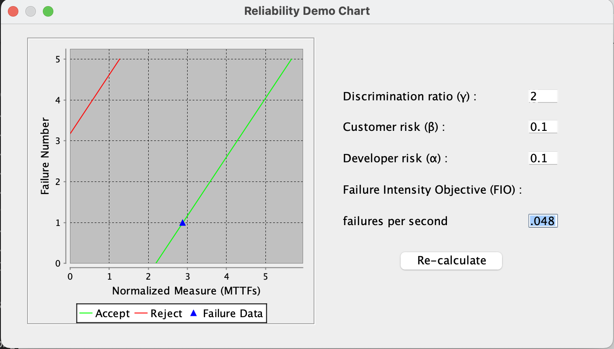

**SENG 438- Software Testing, Reliability, and Quality**

**Lab. Report \#5 – Software Reliability Assessment**

| Group \#:      | 16                        |
| -------------- | ------------------------- |
| Student Names: | Dominic Choi              |
|                | Angelo Jerome T. Reynante |
|                | Nathan Ante               |
|                | Karam Baroud              |

# Introduction
This lab was just opening the dataset provided in the example files and then observed the data.
# 

# Assessment Using Reliability Growth Testing 

# Assessment Using Reliability Demonstration Chart 
We used RDC-11 to assess with RDC and we used Failure Report 8 

When using the RDC, playing with different values can changes the results drastically. 
- Increasing the Customer Risk and/or Developer Risk causes the continue region to shrink which results in less testing being needed to determine if the software should be rejected or accepted. 
- Decreasing Customer Risk and/or Developer Risk widens the continue region and results in the system requiring more testing.
- Increasing the Discrimination Ratio causes the continue region to shrink, which results in the system requiring less testing to accept or reject it.
- Decreasing the Discrimination Ratio widens the continue region and results in requiring more testing.

<!-- - here is the time between failures dataset used for RDC assessment
 -->

We used **CSR1.DAT**

The Failure Intensity(Failures Per Second) that resulted in the minimum MTTFmin that is still acceptable was 0.048 Failures/second. Doubling this value causes failure data to highly exceed the acceptable threshold. Halving this value causes the failure data to fall quite short of this threshold which means the SUT still needs more testing.

using

# Comparison of Results

# Discussion on Similarity and Differences of the Two Techniques

# How the team work/effort was divided and managed

# 

# Difficulties encountered, challenges overcome, and lessons learned
We had issues on importing the data in one of the example files in the sample input folder. Now, we've learned how to import the data on the STRAT application by just copying the data from the Failure Report document and paste the choosen column in the text file. Then run it in STRAT

# Comments/feedback on the lab itself
Overall. This lab is harder than the previous ones
