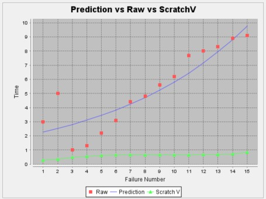
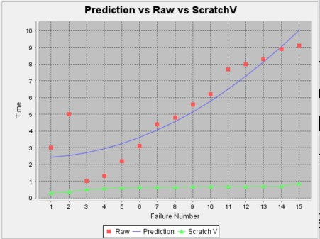

**SENG 438- Software Testing, Reliability, and Quality**

**Lab. Report \#5 – Software Reliability Assessment**

| Group \#:      | 16                        |
| -------------- | ------------------------- |
| Student Names: | Dominic Choi              |
|                | Angelo Jerome T. Reynante |
|                | Nathan Ante               |
|                | Karam Baroud              |

# Introduction
This lab introduces the usage of external tools to assess software reliability. We used 2 methods to assess software reliability: Reliability Growth Testing and Reliability Demonstration Chart (RDC).

Our group is meant to select a failure dataset from the numerous ones provided and use the 2 assessment methods to determine software reliability and whether the software meets standards or not. 

In Part 1, we used SRTAT and the models provided to assess reliability using Reliability Growth Testing.
In Part 2, we used SRTAT again to create RDCs and determine whether the software being assessed should be accepted, rejected, or continue being tested.

Our initial knowledge of Software Reliability Assessment came from content covered in lectures. The lectures explained why and how to use tools like SRTAT to assess software reliability. When using RDCs, we can edit values like Customer Risk, Supplier Risk, and Discrimination Ratio to create the boundaries between the reject, continue, and accept regions. With Reliability Growth Testing, we can create graphs using failure-count or time-between-failure data to visualize software failures and reliability. These graphs help easily determine whether a software product is becoming more reliable over time.

# Assessment Using Reliability Growth Testing 

## Model Comparison

We used SRTAT to assess with RGT and we used **Failure Report 8** 
We can see that the reliability increases over time for both models 

| Number | Raw Data | Geometric Model Prediction | Bayesian Reliability Model Prediction |
|------------|----------|----------------------------|--------------------------------------|
| 1          | 2.0      | 2.043                      | 2.253                                |
| 2          | 3.0      | 2.268                      | 2.342                                |
| 3          | 5.0      | 2.518                      | 2.490                                |
| 4          | 1.0      | 2.795                      | 2.698                                |
| 5          | 1.3      | 3.103                      | 2.965                                |
| 6          | 2.2      | 3.445                      | 3.291                                |
| 7          | 3.1      | 3.824                      | 3.677                                |
| 8          | 4.4      | 4.246                      | 4.122                                |
| 9          | 4.8      | 4.713                      | 4.626                                |
| 10         | 5.6      | 5.232                      | 5.189                                |
| 11         | 6.2      | 5.808                      | 5.812                                |
| 12         | 7.7      | 6.448                      | 6.495                                |
| 13         | 8.0      | 7.158                      | 7.236                                |
| 14         | 8.3      | 7.946                      | 8.037                                |
| 15         | 8.9      | 8.821                      | 8.897                                |
| 16         | 9.1      | 9.793                      | 9.817                                |

## Range Analysis

Geometric Model:

    Maximum prediction: 9.1
    Minimum prediction: 2.0

    Range for Geometric Model: 9.1 - 2.0 = 7.1

Littlewood and Varral's Bayesian Reliability:

    Maximum prediction: 9.1
    Minimum prediction: 1.0

    Range for Bayesian Reliability: 9.1 - 1.0 = 8.1

## Reliability Growth Plots

<figure>
<figcaption>Geometric Model:</figcaption>

</figure>

<figure>
<figcaption>Littlewood and Varral's Bayesian Reliability:</figcaption>

</figure>

## Discussion on decision making of given a target failure rate

**MTTF** = Total operating time / Number of failures = = 79.6 / 16 ≈ 4.975

**Failure Rate** = 1 / MTTF = 1 / 4.975 ≈ 0.201 = 20.1%

This failure rate is quite high and indicates that a substantial portion of the population experiencing a failure.

When given a target failure rate, we need to understand what constitutes a "failure" and how its measured. And we must also define an acceptable level of failure rate, if the failure rate meets the target then the choices are to maintain this reliability or improve it. Otherwise, more testing may be required in order to reach that target.

## Discussion on the advantages and disadvantages of reliability growth analysis

- **Advantages:**
    - Identifies weaknesses or vulnerabilities. This allows for targeted improvments to enhance reliability.

    - It allows for continuous improvement by tracking reliability over time. Iterative improvments can be implemented to address issues and enhance overall reliability.

- **Disadvantages:**
    - It may be resource extensive as it requires testing, analysis, and then implementation.

    - Reliability growth analysis involves complex statistical methods and techniques, which may require specialized knowledge and expertise to interpret and apply effectively.

# Assessment Using Reliability Demonstration Chart 
We used SRTAT to assess with RDC and we used **Failure Report 8** 

When using the RDC, playing with different values can changes the results drastically. 
- Increasing the Customer Risk and/or Developer Risk causes the continue region to shrink which results in less testing being needed to determine if the software should be rejected or accepted. 
- Decreasing Customer Risk and/or Developer Risk widens the continue region and results in the system requiring more testing.
- Increasing the Discrimination Ratio causes the continue region to shrink, which results in the system requiring less testing to accept or reject it.
- Decreasing the Discrimination Ratio widens the continue region and results in requiring more testing.

<!-- - here is the time between failures dataset used for RDC assessment -->

We used **Failure Report 8.txt**

<figure>
<figcaption>The Failure Intensity(Failures Per Second) that resulted in the minimum MTTFmin that is still acceptable was 1.45 Failures/second.</figcaption>

</figure>

<figure>
<figcaption>Doubling this value causes failure data to highly exceed the acceptable threshold.</figcaption>

</figure>

<figure>
<figcaption>
Halving this value causes the failure data to fall quite short of this threshold which means the SUT still needs more testing.
</figcaption>

</figure>

## Discussion on the advantages and disadvantages of reliability demonstration chart

- **Advantages:**
    - Provides an easy to interpret visual chart that shows how reliability changes over time.
    - Helps in tracking progress and see if SUT is meeting reliability goals and spot problems early.

- **Disadvantages:**
    - Can't always predict future reliability accurately due to external factors.
    -  Relying too much on the charts might cause other important factors to be ignored.

# Comparison of Results

# Discussion on Similarity and Differences of the Two Techniques
- we can change some variables when using RDC, but cannot in RGT

- **Similarities:**
    - Both methods aim to enhance the reliability of the system
    - Both use visuals to show reliability trends
    - Both help in tracking reliability over time to see if goals are met
    - Both help in making informed decisions on where to allocate more resources and improvements

- **Differences:**
    - Reliability Demonstration Charts track past reliability, while Reliability Growth Analysis aims to improve future reliability
    - RDCs focus on overall performance, while Growth Analysis may target specific weaknesses

# How the team work/effort was divided and managed
All work was done in-person and together as a group.

# Difficulties encountered, challenges overcome, and lessons learned
We had issues on importing the data in one of the example files in the sample input folder. Now, we've learned how to import the data on the STRAT application by just copying the data from the Failure Report document and paste the choosen column in the text file. Then run it in STRAT

# Comments/feedback on the lab itself
Overall, this lab's instructions were a bit confusing since we did not know we had to copy data to text files. We also had trouble using SRTAT with Mac and there was no troubleshooting material to help. This lab was nice and short though, and was a good way to end the semester. Thank!
